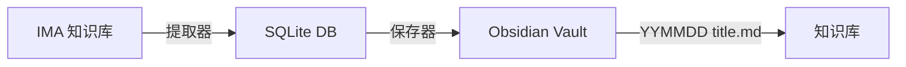

# IMA to Obsidian — AI 上下文导航

> **项目定位**: IMA AI 知识库文章批量提取 → Obsidian 保存自动化工具链

---

## 快速导航

| 组件 | 文档 | 用途 |
|------|------|------|
| **提取器** | [EXTRACTOR.md](./EXTRACTOR.md) | 从 IMA 批量提取文章 URL |
| **保存器** | [SAVER.md](./SAVER.md) | 保存文章到 Obsidian Vault |
| **数据库** | [DATABASE.md](./DATABASE.md) | SQLite 存储结构 |

---

## 工作流概览



---

## 核心命令

### 提取文章
```bash
# 启动 cua-driver daemon
cua-driver serve &

# 提取 AI 知识库
python3 ima_ax_extractor.py --src AI

# 提取个人知识库
python3 ima_ax_extractor.py --src <知识库名>
```

### 保存到 Obsidian
```bash
# 预览模式
python3 ima_obsidian_saver.py --dry-run

# 保存前 10 篇
python3 ima_obsidian_saver.py --limit 10

# 保存到指定文件夹
python3 ima_obsidian_saver.py --des AI

# 使用 Safari
python3 ima_obsidian_saver.py --browser safari
```

---

## 技术栈

- **macOS UI**: cua-driver + AX Tree
- **自动化**: AppleScript + subprocess
- **存储**: SQLite3
- **网络**: requests

---

## 依赖

```bash
# Python 包
pip install requests

# 外部工具
# 1. cua-driver - macOS UI 自动化
# 2. Obsidian Web Clipper - 浏览器扩展
```

---

## 目录结构

```
Ima2Obsidian/
├── ima_ax_extractor.py      # 文章 URL 提取器
├── ima_obsidian_saver.py    # Obsidian 保存器
├── ima_articles.db          # SQLite 数据库
├── CLAUDE.md                # 本文件（导航地图）
├── EXTRACTOR.md             # 提取器详细文档
├── SAVER.md                 # 保存器详细文档
└── DATABASE.md              # 数据库文档
```

---

## 快速开始

1. **初始化数据库**: 首次运行提取器自动创建
2. **启动 cua-driver**: `cua-driver serve &`
3. **打开 IMA**: 定位到目标知识库列表页
4. **运行提取器**: `python3 ima_ax_extractor.py --src AI`
5. **运行保存器**: `python3 ima_obsidian_saver.py --dry-run` 先预览

---

## 注意事项

- **辅助功能**: macOS 需授权终端/Python 辅助功能权限
- **浏览器**: Chrome/Edge/Safari 需安装 Obsidian Web Clipper
- **Obsidian**: 必须保持运行并打开目标 Vault
- **快捷键**: 保存期间勿操作键盘鼠标

---

*详细信息请查看各组件独立文档*
